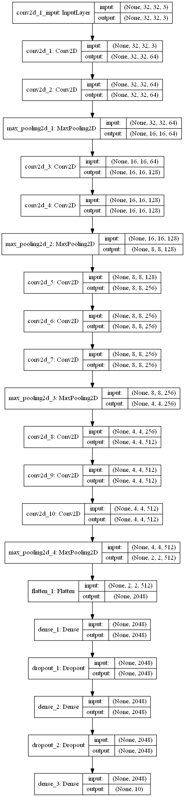
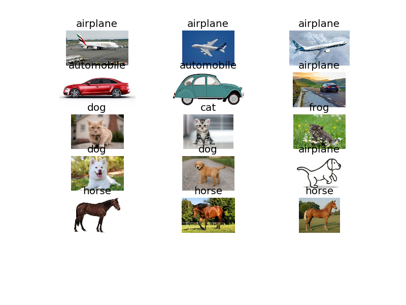
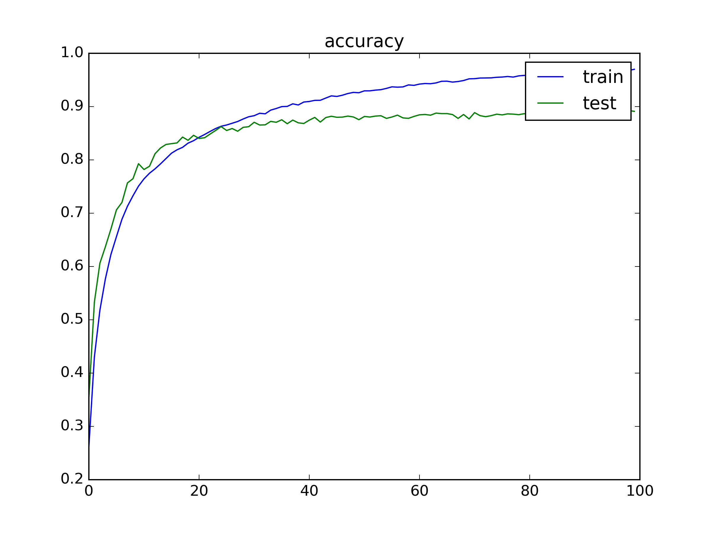

# VGGNet --  A simple media computing practice project

This is a image classification on CIFAR-10 dataset by simplifying the VGG16 model.

## Envoriment

Python 3.5

Keras 2.2.2

tensorflow-gpu 1.3.0

Maybe other versions all works well!

## Pretrained Model

This is a [pre-trained model](https://pan.baidu.com/s/1brJSkic5gYxkj1zuYWlBfw) I trained, but it isn't tuned optimally!

## Result

model structure

classification result

train result

## Related repos and datasets

[VGG16](https://arxiv.org/abs/1409.1556) 

[CIFAR-10](http://www.cs.toronto.edu/~kriz/cifar.html) Download the python verison

